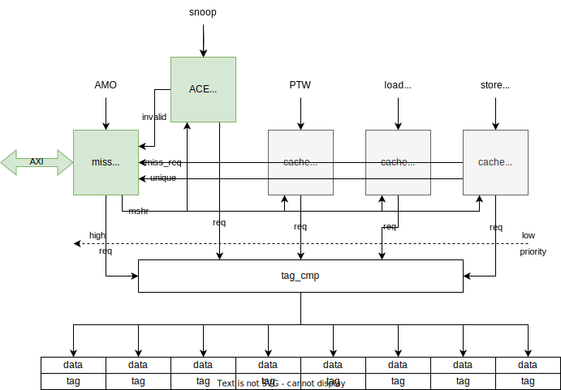
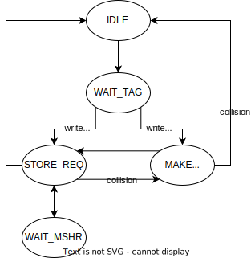
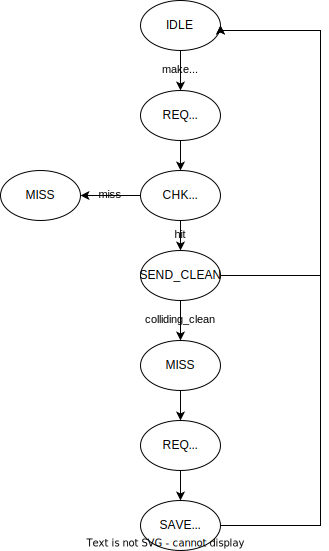

# Write-back cache extensions for snooping-based coherence

## Introduction

The CVA6 architecture, by default, employs a write-through cache strategy. While write-through caches guarantee data consistency by immediately updating the main memory, they often suffer from excessive traffic during write operations. This traffic can lead to higher memory access latency and slower system performance, particularly in scenarios where write-intensive workloads are prevalent. On the other hand, Write-back caches enhance system performance by reducing the memory access latency and improving overall efficiency. in this project, we are modifying the LSU of the CVA6 architecture to incorporate a write-back cache. However, implementing a write-back cache introduces the challenge of maintaining cache coherence in multi-processor systems. In this project, we are implementing a sophisticated cache coherency mechanism to boost the performance for dual-core/quad-core CVA6. In designing our cache coherence mechanism, we have selected an implementation scheme based on the ACE (AxCache Coherent Extensions) specifications, driven by the following motivations:

- **Compatibility:** By adopting ACE, we leverage an existing standardized framework, eliminating the need to invent a proprietary protocol and ensuring compatibility with other ACE-compliant systems.
- **Reduced Complexity:** Implementing a subset of the ACE specifications allows us to focus specifically on inter-CPUs communications, streamlining the design process and reducing overall complexity.
- **Scalability:** The ACE-based implementation serves as a solid foundation, enabling easy integration with a full-featured ACE interface in the future, accommodating potential scalability requirements.
- **Performance Focus:** Given our system\'s configuration with 2 or 4 CPUs, we prioritize the WB (Write-Back) cache strategy as it offers superior performance characteristics.
- **Write-Invalidate Protocol:** To maintain cache coherence, we choose the write-invalidate protocol, which aligns with the ACE specifications and ensures data consistency across caches when a processor writes to a memory location.

Regarding memory locations, we consider the following types:

-   **Shareable and Cacheable:** Memory locations that allow efficient read and write operations across multiple CPUs, ensuring effective data sharing and caching.
-   **Shareable but Non-Cacheable:** The usefulness of this configuration remains a question, requiring further analysis to determine its practical implications and potential benefits.
-   **Non-Shareable but Cacheable:** Memory locations that are not shared among processors but can be cached individually, improving performance for specific data access patterns.
-   **Non-Shareable and Non-Cacheable:** These memory locations, often associated with device access, bypass caching mechanisms to maintain data integrity.\

Based on the various types of memory locations mentioned above, we have identified specific scenarios for load/store operations from the master (cache controller). These scenarios have been summarized in a table, including the initial cache state, final cache state, and the outgoing transaction to the snoop master for each scenario.

## Master issuing a transaction 

| **Operation**            | **Type of data**             | **Cache initial status** | **Outgoing transaction** | **Snoop transaction** |                                                                                                                      | **Cache final status** |
| ------------------------ | ---------------------------- | ------------------------ | ------------------------ | --------------------- | -------------------------------------------------------------------------------------------------------------------- | ---------------------- |
| Read                     | cacheable                    | UC, UD, SC, SD           | \-                       | \-                    | trivial                                                                                                              | UC, UD, SC, SD         |
| Read                     | non-shareable, cacheable     | I                        | ReadNoSnoop              | \-                    | transaction forwarded to target                                                                                      | UC                     |
| Read                     | shareable, cacheable         | I                        | ReadShared               | ReadShared            | if a cache responds positively, use that data                                                                        | SC, SD                 |
| Read                     | shareable, cacheable         | I                        | ReadShared               | ReadShared            | if no cache responds positively, use data from memory1                                                    | UC                     |
| Read                     | shareable, non-cacheable     | \-                       | ReadOnce                 | ReadOnce              | if a cache responds positively, use that data; otherwise, use data from memory1                           | \-                     |
| Read                     | non-shareable, non-cacheable | \-                       | ReadNoSnoop              | \-                    | transaction forwarded to target                                                                                      | \-                     |
| Write                    | non-shareable, cacheable     | I                        | ReadNoSnoop              | \-                    | trivial                                                                                                              | UD                     |
| Write                    | non-shareable, cacheable     | UC, UD                   | \-                       | \-                    | trivial                                                                                                              | UD                     |
| Write                    | shareable                    | SD, SC                   | CleanUnique              | CleanInvalid          | update cache at the end of snooping                                                                                  | UD                     |
| Write                    | shareable                    | UC, UD                   | \-                       | \-                    | trivial                                                                                                              | UD                     |
| Write                    | shareable                    | I                        | ReadUnique               | ReadUnique            | if a cache responds positively, use that data; otherwise, use data from memory1. Update the cache content | UD                     |
| Write                    | shareable, non-cacheable     | \-                       | WriteUnique              | CleanInvalid          | transaction forwarded to target                                                                                      | \-                     |
| Write                    | non-shareable, non-cacheable | \-                       | WriteNoSnoop             | \-                    | transaction forwarded to target                                                                                      | \-                     |
| Writeback after eviction |                              | SD, UD                   | WriteBack                | \-                    | data forwarded to memory                                                                                             | \-                     |

1.  it is possible to fetch data from memory while waiting for the response from the caches: this can save time but add unnecessary traffic towards the shared memory

## Master receiving a snoop transaction 

| **Incoming snoop transaction** | **Cache initial status** | **Cache final status** |                                   |
| ------------------------------ | ------------------------ | ---------------------- | --------------------------------- |
| ReadOnce                       | I                        | I                      | \-                                |
| ReadOnce                       | SC, SD, UC, UD           | SC,SD, UC, UD          | forward cache content             |
| ReadShared                     | I                        | I                      | \-                                |
| ReadShared                     | SC, SD, UC, UD           | SC, SD                 | forward cache content             |
| CleanInvalid                   | I, SC, UC                | I                      | \-                                |
| CleanInvalid                   | SD, UD                   | I                      | Update memory content1 |
| ReadUnique                     | I                        | I                      | \-                                |
| ReadUnique                     | SC, SD, UC, UD           | I                      | transfer cache content            |

1.  Data transfer is necessary. A CleanInvalid is the result of a **CleanUnique** or **WriteUnique**:
    -  **CleanUnique**: the master has a copy of a the cacheline, the CleanInvalid results in a transfer of the ownership (Updating the shared memory would in this case be redundant).
    -  **WriteUnique**: the master could write a portion of the cacheline, so the shared memory must be up-to-date.

## Block diagram

The above block diagram shows the top-level view of the multicore processor used to test the cache coherency unit (CCU) under development.

The development will also affect the CPU.Icache and CPU.Dcache.

## Cache controller

The baseline implementation is straight forward. CVA6 has a single AXI port to access the rest of the system and a stream arbiter multiplexes the read and write requests generated by the caches (or directly by the CPU, if the caches are in fact bypassed).

-   Extend axi\_req and axi\_resp ports to support ACE (AxDOMAIN, AxCACHE, AxBAR, xACK, RRESP)
-   Add ace\_req and ace\_resp ports (for snooping)
    -   accepted snooping transactions: ReadOnce, ReadShared, ReadUnique, CleanInvalid
-   The controller can process contemporary requests coming from the CPU and the interconnect, if targeting different cache lines
-   The controller must arbitrate requests coming from the CPU and the interconnect, if targeting the same cache line
-   The arbiter must broadcast snooping messages towards the caches and merge answers towards the interconnect

## Data cache

The cache must be extended with

-   new port to support snooping requests
-   extend the miss\_handler to support line invalidation
-   extend the existing modules to send ACE information over AXI

## snoop\_cache\_ctrl

The diagram above represents the FSM of the cache controller module which processes the snooping requests:

-   the controller reacts upon read and invalidate requests coming from the interconnect
-   if the cache is active, the first step is to get the tags and flags for that cacheline (as performed by the cache\_ctrl - WAIT\_TAG)
    -   a request to the tag\_cmp is sent
-   in case of incoming read requests
    -   in case of cache hit and ReadUnique request, the target cacheline must be invalidated (INVALIDATE)
        -   a writeback is not necessary since there is an ownership transfer
    -   in case of cache hit and ReadShared request, the target cacheline must be marked as shared (UPDATE\_SHARED)
    -   data are sent to the interconnect only in case of read requests hitting a cacheline (SEND\_RESP)
-   in case of incoming invalidate request
    -   in case of a cache hit, the target cacheline must be invalidated (INVALIDATE)
    -   in case of dirty cacheline, a writeback is necessary
        -   this is not performed by the cache controller, but it delegates the interconnector by forwarding the hit cacheline data
-   unsupported snoop requests result in a snoop response with active error flag

Incoming snoop transactions are not processed immediately if the targeted cacheline is being modified by other cache controllers.

### cache\_ctrl

Compared to the original version, the cache controller must be able to send CleanUnique transactions (through the miss\_handler, which controls the AXI interface), in case a write request hits a shared cacheline.

It might occur that a CleanUnique is sent while the cache controller receives (through snoop\_cache\_ctrl) a CleanUnique transaction. The miss\_handler takes care of this situation by issuing a ReadUnique transaction right after the termination of the CleanUnique; as the ReadUnique terminates, the miss\_handler can directly update the cacheline content with the new data: so in this case the cache\_ctrl doesn't have to perform any write in cache and can accept a new request (i.e. the FSM goes back to IDLE).

It might also occur that a CleanUnique is sent while the cache controller receives (through snoop\_cache\_ctrl) a ReadShared transaction. In case the cache\_ctrl detects this situation (i.e. there has been a collision), the CleanUnique must be sent again and the status is set again to MAKE\_UNIQUE.

### miss\_handler

The diagram above represents the extension needed for the miss\_handler to support invalidate requests:

-   while in IDLE state, the miss\_handler also listens for make\_unique requests coming from the other cache controllers (to write cachelines which are not in UD or US state)
-   the vanilla flow of operations would require the miss\_handler to start a CleanUnique transaction, and releasing the cache\_ctrl once finished
-   it might happen that the miss\_handler starts processing the make\_unique request when this has already been processed (e.g. the store cache\_ctrl receives the store request when the cacheline was valid, but the miss\_handler was busy serving another request; during this time the cacheline might be invalidated); to avoid data corruption, the miss\_handler first checks the status of the cacheline, and evaluates whether to start a CleanUnique (SEND\_CLEAN) or a ReadUnique (MISS) transaction
-   it might happen that a CleanInvalid or ReadUnique requests are received while the miss\_handler has started a CleanUnique transaction (SEND\_CLEAN); in this case the cacheline must be requested again (MISS)

In a multicore system which implements a cache coherence mechanism it is not necessary to flush the whole cache when a `fence` instruction has been received or when an AMO is executed.

Preventing a full data cache flush in case of `fence` can be done by not setting the corresponding `flush` signal in CVA6's controller.

In case of AMO, it is only necessary to write back the targeted cacheline before performing the requested atomic operation.

## Instruction cache

The original instruction cache has essentially remained not modified: the only necessary change is the adaptation of the memory interface, from AXI to ACE.

The transactions generated by the instruction cache are labelled as ReadShared, because it can happen that core A prepares the instruction for core B via store instructions: core B must therefore be able to fetch the new instructions from core A's data cache, and this is only possible via ReadShared.

## Interconnector

The interconnector is an essential component when implementing a system which makes use of this WB cache.

Refer to the related [documentation](https://github.com/planvtech/ace/blob/pulp/doc/ace_ccu_top.md).

## Summary of cornercases

- Incoming CleanInvalid while sending ReadUnique/CleanUnique: resolved by re-sending a CleanUnique transaction (see miss\_handler and cache\_ctrl)
- Incoming ReadShared while sending ReadUnique/CleanUnique: resolved by re-sending CleanUniqe (see cache\_ctrl)
- Incoming snoop request while updating the cache content: resolved by delaying the processing the the snoop request until the end of the cache update

## Known limitations

- ReadShared instead of a ReadNoSnoop to fetch instruction: this is necessary if it cannot be guaranteed at software level (e.g. by flushing the data cache before starting the exectution of the new program) that all instructions are in the shared memory; if the software can guarantee this, the `axi_req_o.ar.domain` flag set in axi\_shim can be updated

For limitations concerning the CCU, see the related [documentation](https://github.com/planvtech/ace/blob/pulp/doc/ace_ccu_top.md).